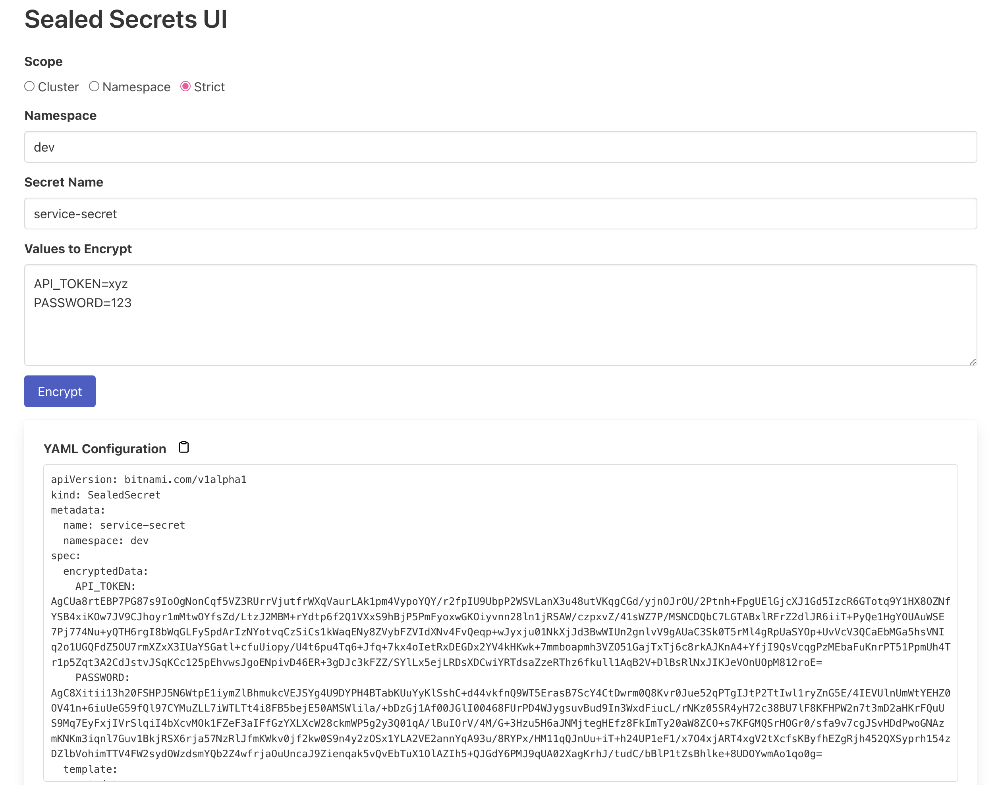

# Sealed Secrets UI

Sealed Secrets UI provides a simple and intuitive web interface for creating and managing sealed secrets in Kubernetes. This service simplifies the traditional command-line workflow, making it easier for developers to securely manage secrets without remembering complex kubectl commands.




## Features

- 🖥️  Simple Web Interface: Create and update sealed secrets directly through a user-friendly web interface.
- 🔗 Seamless Integration: Works with existing Kubernetes sealed secrets, fetching the necessary public keys directly from the Sealed Secrets controller.
- 🧠 Intelligent Management: Checks if secrets already exist and appends new values from the UI, avoiding unnecessary duplication.
- ⚙️ Environment Customization: Configure through environment variables to specify the namespace and controller name for the Sealed Secrets controller.

## Prerequisites

Before deploying the Sealed Secrets UI, ensure that the [Sealed Secrets controller by Bitnami](https://github.com/bitnami-labs/sealed-secrets) is installed in your cluster. The UI is designed to fetch the public key from this controller to encrypt secret data.

- The Sealed Secrets Helm chart should be installed.
- If installed with default settings, no environment variables need to be set for controller namespace or name.

## Configuration

The application fetches the controller's public key using configurable environment variables:

- **SEALED_SECRETS_CONTROLLER_NAMESPACE**: Defaults to **kube-system** if left unset.
- **SEALED_SECRETS_CONTROLLER_NAME**: Defaults to **sealed-secrets-controller** if left unset.

These settings align with the default installation via Helm.

## Service Account

While the Sealed Secrets UI can utilize the service account created by the sealed-secrets controller, it's not mandatory. You can create a separate service account with appropriate roles and bindings, ensuring it has permissions to GET secrets from the intended namespaces.

## Deployment

Below is a sample deployment configuration for deploying the Sealed Secrets UI in Kubernetes:

```yaml
apiVersion: apps/v1
kind: Deployment
metadata:
  name: sealed-secrets-ui
  namespace: kube-system
  labels:
    app.kubernetes.io/instance: sealed-secrets-ui
    app.kubernetes.io/name: sealed-secrets-ui
spec:
  replicas: 1
  selector:
    matchLabels:
      app.kubernetes.io/instance: sealed-secrets-ui
      app.kubernetes.io/name: sealed-secrets-ui
  template:
    metadata:
      labels:
        app.kubernetes.io/instance: sealed-secrets-ui
        app.kubernetes.io/name: sealed-secrets-ui
    spec:
      serviceAccountName: sealed-secrets-controller
      containers:
        - name: sealed-secrets-ui
          image: alpheya/sealed-secrets-ui:0.3.3
          imagePullPolicy: IfNotPresent
          ports:
            - containerPort: 8080
          resources:
            requests:
              cpu: 100m
              memory: 128Mi
            limits:
              cpu: 150m
              memory: 192Mi
          livenessProbe:
            httpGet:
              path: /healthz
              port: http
            initialDelaySeconds: 10
            periodSeconds: 10
          readinessProbe:
            httpGet:
              path: /healthz
              port: http
            initialDelaySeconds: 10
            periodSeconds: 10
```

```yaml
apiVersion: v1
kind: Service
metadata:
  name: sealed-secrets-ui
  namespace: kube-system
  labels:
    app.kubernetes.io/instance: sealed-secrets-ui
    app.kubernetes.io/name: sealed-secrets-ui
spec:
  ports:
    - name: http
      port: 8080
      targetPort: 8080
      protocol: TCP
  selector:
    app.kubernetes.io/name: sealed-secrets-ui
  type: ClusterIP
```

## Accessing the UI

After deployment, access the Sealed Secrets UI through the service's ClusterIP on port 8080 or configure ingress rules as needed for external access.
